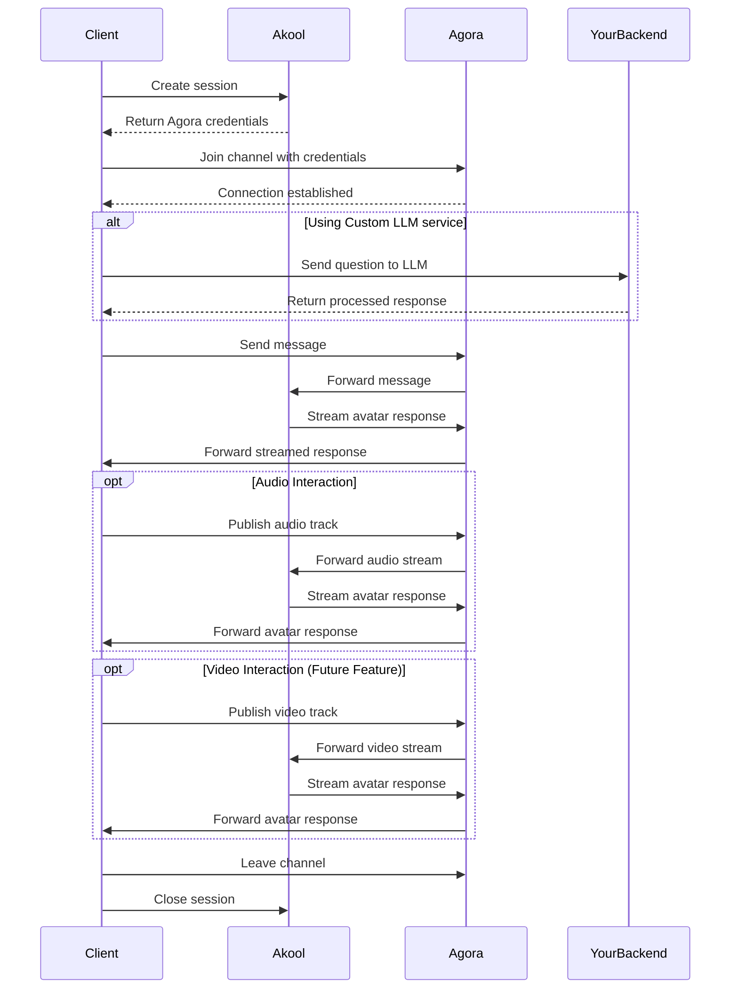

## Overview

The Streaming Avatar feature allows you to create interactive, real-time avatar experiences in your application. This guide provides a comprehensive walkthrough of integrating streaming avatars using the Agora SDK, including:

- Setting up real-time communication channels
- Handling avatar interactions and responses
- Managing audio streams
- Implementing cleanup procedures
- Optional LLM service integration

The integration uses Agora's Real-Time Communication (RTC) SDK for reliable, low-latency streaming and our avatar service for generating responsive avatar behaviors.

## Prerequisites

1. Install the Agora SDK in your project:

```bash
npm install agora-rtc-sdk-ng
# or
yarn add agora-rtc-sdk-ng
```

2. Import the required dependencies:

```ts
import AgoraRTC, { IAgoraRTCClient } from "agora-rtc-sdk-ng";
```

3. Add the hidden API of Agora SDK

Agora SDK's sendStreamMessage is not exposed, so we need to add it manually. And it has some limitations, so we need to handle it carefully.

We can infer [from the doc](https://docs.agora.io/en/voice-calling/troubleshooting/error-codes?platform=android#data-stream-related-error-codes) that the message size is limited to 1KB and the message frequency is limited to 6KB per second.

The Agora SDK's `sendStreamMessage` method needs to be manually added to the type definitions:

```ts
interface RTCClient extends IAgoraRTCClient {
  sendStreamMessage(msg: Uint8Array | string, flag: boolean): Promise<void>;
}
```

> **Important**: The Agora SDK has the following limitations:
> - Maximum message size: 1KB
> - Maximum message frequency: 6KB per second

## Integration Flow



## Key Implementation Steps

### 1. Create a Live Avatar Session

First, create a session to obtain Agora credentials:

```ts
type Session = {
  _id: string;
  credentials: {
    agora_app_id: string;
    agora_channel: string;
    agora_token: string;
    agora_uid: number;
  };
}

async function createSession(): Promise<Session> {
  const response = await fetch('https://openapi.akool.com/api/open/v4/liveAvatar/session/create', {
    method: 'POST',
    headers: {
      'Authorization': 'Bearer YOUR_TOKEN',
      'Content-Type': 'application/json'
    },
    body: JSON.stringify({
      avatar_id: "dvp_Tristan_cloth2_1080P",
      duration: 600, // seconds
    })
  });

  if (!response.ok) {
    throw new Error(`Failed to create session: ${response.status} ${response.statusText}`);
  }

  const res = await response.json();
  return res.data;
}
```

### 2. Initialize Agora Client

Create and configure the Agora client:

```ts
async function initializeAgoraClient(credentials) {
  const client = AgoraRTC.createClient({
    mode: 'rtc',
    codec: 'vp8'
  });

  try {
    await client.join(
      credentials.agora_app_id,
      credentials.agora_channel,
      credentials.agora_token,
      credentials.agora_uid
    );
    
    return client;
  } catch (error) {
    console.error('Error joining channel:', error);
    throw error;
  }
}
```

### 3. Subscribe Audio and Video Stream

Subscribe to the audio and video stream of the avatar:

```ts
async function subscribeToAvatarStream(client: IAgoraRTCClient) { 
  const onUserPublish = async (user: IAgoraRTCRemoteUser, mediaType: 'video' | 'audio') => {
    const remoteTrack = await client.subscribe(user, mediaType);
    remoteTrack.play();
  };

  const onUserUnpublish = async (user: IAgoraRTCRemoteUser, mediaType: 'video' | 'audio') => {
    await client.unsubscribe(user, mediaType);
  };

  client.on('user-published', onUserPublish);
  client.on('user-unpublished', onUserUnpublish);
}
```

### 4. Set Up Message Handling

Configure message listeners to handle avatar responses:

```ts
function setupMessageHandlers(client: IAgoraRTCClient) {
  let answer = '';
  client.on('stream-message', (uid, message) => {
    try {
      const parsedMessage = JSON.parse(message);
      
      if (parsedMessage.type === 'chat') {
        const payload = parsedMessage.pld;
        
        if (payload.from === 'bot') {
          if (!payload.fin) {
            answer += payload.text;
          } else {
            console.log('Avatar response:', answer);
            answer = '';
          }
        } else if (payload.from === 'user') {
          console.log('User message:', payload.text);
        }
      } else if (parsedMessage.type === 'command') {
        if (parsedMessage.pld.code !== 1000) {
          console.error('Command failed:', parsedMessage.pld.msg);
        }
      }
    } catch (error) {
      console.error('Error parsing message:', error);
    }
  });
}
```

### 5. Send Messages to Avatar

Implement functions to interact with the avatar:

```ts
async function sendMessageToAvatar(client: IAgoraRTCClient, question: string) {
  const message = {
    v: 2,
    type: "chat",
    mid: `msg-${Date.now()}`,
    idx: 0,
    fin: true,
    pld: {
      text: question,
    }
  };

  try {
    await client.sendStreamMessage(JSON.stringify(message), false);
  } catch (error) {
    console.error('Error sending message:', error);
    throw error;
  }
}
```

In real-world scenarios, the message size is limited to 1KB and the message frequency is limited to 6KB per second, so we need to split the message into chunks and send them separately.

```ts
export async function sendMessageToAvatar(client: RTCClient, messageId: string, content: string) {
  const MAX_ENCODED_SIZE = 950;
  const BYTES_PER_SECOND = 6000;

  // Improved message encoder with proper typing
  const encodeMessage = (text: string, idx: number, fin: boolean): Uint8Array => {
    const message: StreamMessage = {
      v: 2,
      type: 'chat',
      mid: messageId,
      idx,
      fin,
      pld: {
        text,
      },
    };
    return new TextEncoder().encode(JSON.stringify(message));
  };

  // Validate inputs
  if (!content) {
    throw new Error('Content cannot be empty');
  }

  // Calculate maximum content length
  const baseEncoded = encodeMessage('', 0, false);
  const maxQuestionLength = Math.floor((MAX_ENCODED_SIZE - baseEncoded.length) / 4);

  // Split message into chunks
  const chunks: string[] = [];
  let remainingMessage = content;
  let chunkIndex = 0;

  while (remainingMessage.length > 0) {
    let chunk = remainingMessage.slice(0, maxQuestionLength);
    let encoded = encodeMessage(chunk, chunkIndex, false);

    // Binary search for optimal chunk size if needed
    while (encoded.length > MAX_ENCODED_SIZE && chunk.length > 1) {
      chunk = chunk.slice(0, Math.ceil(chunk.length / 2));
      encoded = encodeMessage(chunk, chunkIndex, false);
    }

    if (encoded.length > MAX_ENCODED_SIZE) {
      throw new Error('Message encoding failed: content too large for chunking');
    }

    chunks.push(chunk);
    remainingMessage = remainingMessage.slice(chunk.length);
    chunkIndex++;
  }

  log(`Splitting message into ${chunks.length} chunks`);

  // Send chunks with rate limiting
  for (let i = 0; i < chunks.length; i++) {
    const isLastChunk = i === chunks.length - 1;
    const encodedChunk = encodeMessage(chunks[i], i, isLastChunk);
    const chunkSize = encodedChunk.length;

    const minimumTimeMs = Math.ceil((1000 * chunkSize) / BYTES_PER_SECOND);
    const startTime = Date.now();

    log(`Sending chunk ${i + 1}/${chunks.length}, size=${chunkSize} bytes`);

    try {
      await client.sendStreamMessage(encodedChunk, false);
    } catch (error: unknown) {
      throw new Error(`Failed to send chunk ${i + 1}: ${error instanceof Error ? error.message : 'Unknown error'}`);
    }

    if (!isLastChunk) {
      const elapsedMs = Date.now() - startTime;
      const remainingDelay = Math.max(0, minimumTimeMs - elapsedMs);
      if (remainingDelay > 0) {
        await new Promise((resolve) => setTimeout(resolve, remainingDelay));
      }
    }
  }
}
```

### 6. Control Avatar Parameters

Implement functions to control avatar settings:

```ts
async function setAvatarParams(client: IAgoraRTCClient, params: {
  vid?: string;
  lang?: string;
  mode?: number;
  bgurl?: string;
}) {
  const message = {
    v: 2,
    type: 'command',
    mid: `msg-${Date.now()}`,
    pld: {
      command: 'set-params',
      data: params
    }
  };

  await client.sendStreamMessage(JSON.stringify(message), false);
}

async function interruptAvatar(client: IAgoraRTCClient) {
  const message = {
    v: 2,
    type: 'command',
    mid: `msg-${Date.now()}`,
    pld: {
      command: 'interrupt'
    }
  };

  await client.sendStreamMessage(JSON.stringify(message), false);
}
```

### 7. Audio Interaction With The Avatar

To enable audio interaction with the avatar, you'll need to publish your local audio stream:

```ts
async function publishAudio(client: IAgoraRTCClient) {
  // Create a microphone audio track
  const audioTrack = await AgoraRTC.createMicrophoneAudioTrack();
  
  try {
    // Publish the audio track to the channel
    await client.publish(audioTrack);
    console.log("Audio publishing successful");
    
    return audioTrack;
  } catch (error) {
    console.error("Error publishing audio:", error);
    throw error;
  }
}

// Example usage with audio controls
async function setupAudioInteraction(client: IAgoraRTCClient) {
  let audioTrack;
  
  // Start audio
  async function startAudio() {
    try {
      audioTrack = await publishAudio(client);
    } catch (error) {
      console.error("Failed to start audio:", error);
    }
  }

  // Stop audio
  async function stopAudio() {
    if (audioTrack) {
      // Stop and close the audio track
      audioTrack.stop();
      audioTrack.close();
      await client.unpublish(audioTrack);
      audioTrack = null;
    }
  }

  // Mute/unmute audio
  function toggleAudio(muted: boolean) {
    if (audioTrack) {
      if (muted) {
        audioTrack.setEnabled(false);
      } else {
        audioTrack.setEnabled(true);
      }
    }
  }

  return {
    startAudio,
    stopAudio,
    toggleAudio
  };
}
```

Now you can integrate audio controls into your application:

```ts
async function initializeWithAudio() {
  try {
    // Initialize avatar
    const client = await initializeStreamingAvatar();
    
    // Setup audio controls
    const audioControls = await setupAudioInteraction(client);
    
    // Start audio when needed
    await audioControls.startAudio();
    
    // Example of muting/unmuting
    audioControls.toggleAudio(true); // mute
    audioControls.toggleAudio(false); // unmute
    
    // Stop audio when done
    await audioControls.stopAudio();
    
  } catch (error) {
    console.error("Error initializing with audio:", error);
  }
}
```

For more details about Agora's audio functionality, refer to the [Agora Web SDK Documentation](https://docs.agora.io/en/voice-calling/get-started/get-started-sdk?platform=web#publish-a-local-audio-track).

### 8. Video Interaction With The Avatar (coming soon)

<Warning>
Video interaction is currently under development and will be available in a future release. The following implementation details are provided as a reference for upcoming features.
</Warning>

To enable video interaction with the avatar, you'll need to publish your local video stream:

```ts
// Note: This is a preview of upcoming functionality
async function publishVideo(client: IAgoraRTCClient) {
  // Create a camera video track
  const videoTrack = await AgoraRTC.createCameraVideoTrack();
  
  try {
    // Publish the video track to the channel
    await client.publish(videoTrack);
    console.log("Video publishing successful");
    
    return videoTrack;
  } catch (error) {
    console.error("Error publishing video:", error);
    throw error;
  }
}

// Example usage with video controls (Preview of upcoming features)
async function setupVideoInteraction(client: IAgoraRTCClient) {
  let videoTrack;
  
  // Start video
  async function startVideo() {
    try {
      videoTrack = await publishVideo(client);
      // Play the local video in a specific HTML element
      videoTrack.play('local-video-container');
    } catch (error) {
      console.error("Failed to start video:", error);
    }
  }

  // Stop video
  async function stopVideo() {
    if (videoTrack) {
      // Stop and close the video track
      videoTrack.stop();
      videoTrack.close();
      await client.unpublish(videoTrack);
      videoTrack = null;
    }
  }

  // Enable/disable video
  function toggleVideo(enabled: boolean) {
    if (videoTrack) {
      videoTrack.setEnabled(enabled);
    }
  }

  // Switch camera (if multiple cameras are available)
  async function switchCamera(deviceId: string) {
    if (videoTrack) {
      await videoTrack.setDevice(deviceId);
    }
  }

  return {
    startVideo,
    stopVideo,
    toggleVideo,
    switchCamera
  };
}
```

The upcoming video features will include:
- Two-way video communication
- Camera switching capabilities
- Video quality controls
- Integration with existing audio features

Stay tuned for updates on when video interaction becomes available.

### 9. Integrating your own LLM service (optional)

You can integrate your own LLM service to process messages before sending them to the avatar. Here's how to do it:

```ts
// Define the LLM service response interface
interface LLMResponse {
  answer: string;
}

// Set the avatar to retelling mode
await setAvatarParams(client, {
  mode: 1,
});

// Create a wrapper for your LLM service
async function processWithLLM(question: string): Promise<LLMResponse> {
  try {
    const response = await fetch('YOUR_LLM_SERVICE_ENDPOINT', {
      method: 'POST',
      headers: {
        'Content-Type': 'application/json',
      },
      body: JSON.stringify({
        question,
      })
    });

    if (!response.ok) {
      throw new Error('LLM service request failed');
    }

    return await response.json();
  } catch (error) {
    console.error('Error processing with LLM:', error);
    throw error;
  }
}

async function sendMessageToAvatarWithLLM(
  client: IAgoraRTCClient, 
  question: string
) {
  try {
    // Process the question with your LLM service
    const llmResponse = await processWithLLM(question);

    // Prepare the message with LLM response
    const message = {
      type: "chat",
      mid: `msg-${Date.now()}`,
      idx: 0,
      fin: true,
      pld: {
        text: llmResponse.answer // Use the LLM-processed response
      }
    };

    // Send the processed message to the avatar
    await client.sendStreamMessage(JSON.stringify(message), false);

  } catch (error) {
    console.error('Error in LLM-enhanced message sending:', error);
    throw error;
  }
}
```

*Remember to*:
1. Implement proper rate limiting for your LLM service
2. Handle token limits appropriately
3. Implement retry logic for failed LLM requests
4. Consider implementing streaming responses if your LLM service supports it
5. Cache common responses when appropriate

### 10. Cleanup

Don't forget to clean up when you're done:

```ts
async function cleanup(client: IAgoraRTCClient, sessionId: string) {
  await fetch('https://openapi.akool.com/api/open/v4/liveAvatar/session/close', {
    method: 'POST',
    headers: {
      'Authorization': 'Bearer YOUR_TOKEN'
    },
    body: JSON.stringify({
      id: sessionId
    })
  });

  // Remove event listeners
  client.removeAllListeners('user-published');
  client.removeAllListeners('user-unpublished');
  client.removeAllListeners('stream-message');

  // Stop audio/video and unpublish if they're still running
  if (audioControls) {
    await audioControls.stopAudio();
  }
  if (videoControls) {
    await videoControls.stopVideo();
  }
  
  // Leave the Agora channel
  await client.leave();
}
```

### 11. Putting It All Together

Here's how to use all the components together:

```ts
async function initializeStreamingAvatar() {
  let client;
  try {
    // Create session and get credentials
    const session = await createSession();
    const { credentials } = session;
    
    // Initialize Agora client
    client = await initializeAgoraClient(credentials);

    // Subscribe to the audio and video stream of the avatar
    await subscribeToAvatarStream(client);
    
    // Set up message handlers
    setupMessageHandlers(client);
    
    // Example usage
    await sendMessageToAvatar(client, "Hello!");

    // Or use your own LLM service
    await sendMessageToAvatarWithLLM(client, "Hello!");

    // Example of voice interaction
    await interruptAvatar(client);

    // Example of Audio Interaction With The Avatar
    await setupAudioInteraction(client);

    // Example of changing avatar parameters
    await setAvatarParams(client, {
      lang: "en",
      vid: "new_voice_id"
    });
    
    return client;
  } catch (error) {
    console.error('Error initializing streaming avatar:', error);
    if (client) {
      await cleanup(client, session._id);
    }
    throw error;
  }
}
```

## Additional Resources

- [Agora Web SDK Documentation](https://docs.agora.io/en/sdks?platform=web)
- [Agora Web SDK API Reference](https://api-ref.agora.io/en/video-sdk/web/4.x/index.html)
- [AKool OpenAPI Error Codes](/ai-tools-suite/live-avatar#response-code-description)
